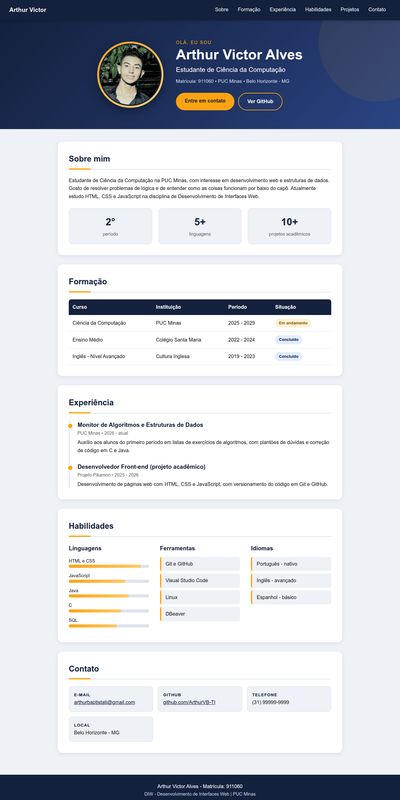

# DIW - Aula 03

## Página Web - Curriculum Vitae

**Arthur Victor Alves - Matrícula: 911060**

Página de currículo desenvolvida com HTML e CSS, aplicando elementos de estrutura
(header, nav, main, section, footer), textuais, multimídia e tabelas, com a
formatação separada no arquivo `style.css`.

### Estrutura do projeto

```
Aula03/
├── public/
│   ├── index.html
│   ├── style.css
│   └── foto.png
├── Images/
│   └── Site.png
└── README.md
```

---

### Resultado no navegador


